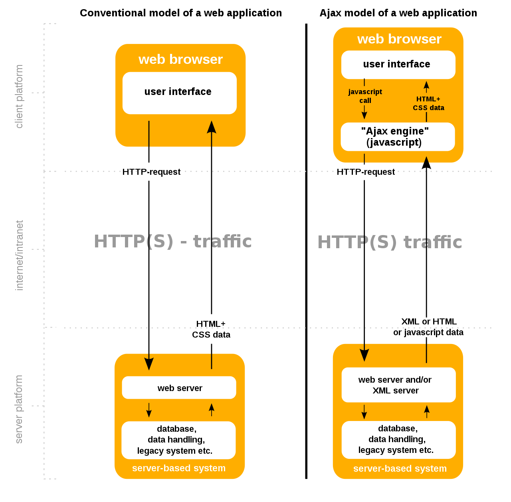
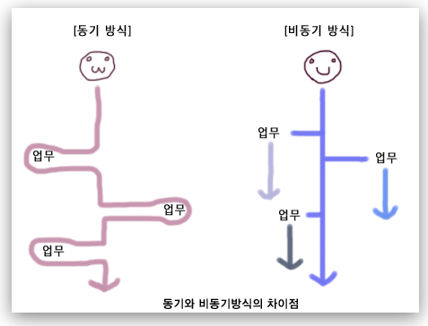

sscriptscript---
layout: post
title: "Ajax"
date: 2021-06-01 10:00:00 +0900
categories: JavaScript
---
# Ajax
---

AJAX란, JavaScript의 라이브러리중 하나이며 Asynchronous Javascript And Xml(비동기식 자바스크립트와 xml)의 약자이다.



이벤트 발생시 서버에서 html+data를 리턴하는것이 아니라 데이터만 리턴하는 방식이다.    
즉 데이터만을 받아오는데 웹페이지를 다시 로드할 필요가없기에 Ajax를 사용하여 비동기식방식으로 데이터만 받아올 수 있다.  

최근에는 xml방식이아닌 JSON으로 통일되어 사용되고 있다.

Ajax는 자바스크립트를 이용하여 Restful의 JSON을 통해 데이터만 주고받는 개념으로 이해하면 될거 같다.

**비동기 방식**  

Ajax는 비동기 방식을 사용하고 있다.  
Thread의 원리랑 비슷하게 생각하면 될 거 같다.  

비동기 방식이란?
- 서버에 요청 후 응답이나 결과에 상관없이 동작이 이루어지는 방식이다.
  
동기 방식이란?
- 서버에 요청 후 응답이나 결과를 받아야만 동작이 이루어지는 방식이다.



[출처] <a href="https://velog.io/@surim014/AJAX%EB%9E%80-%EB%AC%B4%EC%97%87%EC%9D%B8%EA%B0%80">surim014.log
</a>


# Ajax 적용
---

Ajax는 기본적으로 XML HttpRequest , open , send , Call Back function 순서로 실행된다.  

jQuery 사용시 모든게 캡슐화되어있어 쉽게 사용이 가능하다

- XML HttpRequest : Restful의 클라이언트 생성과 같이 리퀘스트를 생성한다.  
(CrossBrowser 문제)
- open : request.open("METHOD(GET,POST)", url, [true,false]) / 전송방식과 루트와 동기/비동기 설정한다. 
- POST방식 해더정보 : request.setRequestHeader("Content-Type",  
"application/x-www-form-urlencoded") 
- Call Back function : request.onreadystatechange = fucntion /데이터가 전송 후 실행시킬 함수를 설정 
- send : 리퀘스트를 보낸다. (파라미터로 정보를 주면 POST방식의 Body에 담겨 보내진다)

**1. XML HttpRequest**  

리퀘스트를 보내는 Ajax리퀘스트를 생성한다.  
CrossBrowser의 문제점을 가지고 있어 jQuery사용시 캡술화하여 생성이 가능하다.  

```html
<script>
	
	var request = null;
	
    // 리퀘스트 생성( 지원하는 브라우져 리퀘스트)
	function createRequest(){
		try {
			request = new XMLHttpRequest();
			//Debug..
			//alert ("XMLHttpRequest() 로 request instancet생성완료");
		} catch (trymicrosoft) {
			try {
				request = new ActiveXObject("Msxml2.XMLHTTP");
				//Debug..
				//alert ("ActiveXObject(Msxml2.XMLHTTP) 로 request instancet생성완료");
			} catch (othermicrosoft) {
				try {
					request = new ActiveXObject("Microsoft.XMLHTTP");
					//Debug..
					//alert ("new ActiveXObject(Microsoft.XMLHTTP) 로 request instancet생성완료");
				} catch (failed) {
					request = null;
				}
			}
		}
	}

</script>
```	

**2. open , send**  

생성된 리퀘스트의 정보를 셋팅하고 보내는 역할을 하는 실질적인 실행 부분 

```html
<script>
	
	//phone 번호를 server로 GET 방식 전송 function    
	function getSold(){
		
		createRequest();
		
        // GET방식은 url에 데이터를 담아 보내준다. ( ?name=value)
        // POST방식은 바디에 데이터를 담아 보내준다.
		var url = "calcServerAjax.jsp";

		//request GET 방식 , 해당url , 비동기로 연결할 것을 결정 : 연결초기화
		request.open("GET", url, true);
		
		//동기
		//request.open("GET", url, false);

        // POST 헤더저보입력
		//request.setRequestHeader("Content-Type","application/x-www-form-urlencoded");

		//updatePage()호출 지정(Call Back function 지정)			
		request.onreadystatechange = updatePage;

        // POST방식 데이터 전송
        //var queryString = "name="+$('#name').val()+"&phone="+$('#phone').val();		

		//request : GET
		request.send(null);
        //request : POST
        //request.send(queryString);
	}
</script>
```

**3. Call Back function**  

실질적으로 데이터가 수정되고 업데이트 되는 부분

```html
<script>
	//Call Back Method 
	function updatePage() {
        
        // HttpRequest는 4단계를 거쳐서 요청과 응답을한다.
        // 4단계 일시 데이터를 받기에 4일때만 접근
		 if (request.readyState == 4) {
			//상태코드 200확인
			if (request.status == 200) {
				
				var value = request.responseText;
				
				value = trim(value);
				// 공백문자제거 
			//	var customerAddress = trim(value);
				alert("====>.updatePage() = "+value);

				//Debug..
			//	alert("Server에서 받은 내용 : \n" + customerAddress);

				//server 에서 전송받은 주소 html에 적용
			//	document.getElementById("address").value = "\n"
			//			+ customerAddress;
			} else {
				alert("에러 발생 : " + request.status+"==>"+request.statusText);
			}		
		}
	}
	
    // 자바스크립트는 트림기능이 따로 없기에 함수를 생성
    // jquery 트림 제공
	function trim(str){
		return str.replace(/^\s\s*/,'').replace(/\s\s*$/,'');
	}
</scrip>
```


